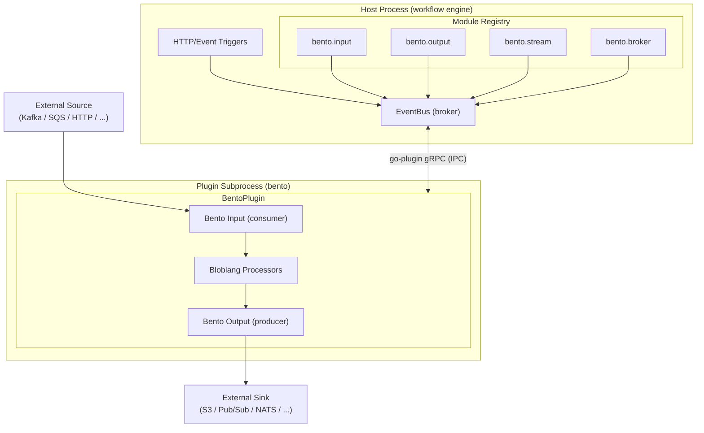
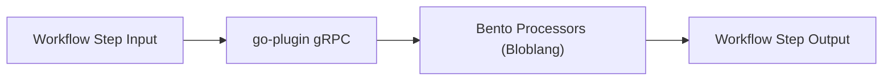

# Bento Stream Processing Plugin for GoCodeAlone/workflow

[](https://github.com/GoCodeAlone/workflow-plugin-bento/actions/workflows/ci.yml)
[](https://github.com/GoCodeAlone/workflow-plugin-bento/releases)
[](https://go.dev/)
[](LICENSE)

An external plugin that integrates [Bento](https://github.com/warpstreamlabs/bento) stream processing into the [GoCodeAlone/workflow](https://github.com/GoCodeAlone/workflow) engine. It runs as an isolated subprocess and communicates with the host engine over gRPC via the [GoCodeAlone/go-plugin](https://github.com/GoCodeAlone/go-plugin) framework.

## Overview

This plugin extends the workflow engine with:

- **100+ pre-built connectors** — Kafka, SQS, GCP Pub/Sub, NATS, Redis, S3, HTTP, and more via Bento's connector catalog
- **Bloblang transforms** — Bento's native mapping language for in-flight data transformation and enrichment
- **At-least-once delivery** — Bento's acknowledgement protocol ensures messages are not lost during processing failures
- **Bidirectional EventBus bridging** — pipe external sources into the workflow EventBus (`bento.input`) or sink EventBus events to external systems (`bento.output`)
- **Inline stream steps** — apply Bloblang processors inside workflow pipelines using `step.bento`

## Architecture

The plugin runs as a subprocess. The host workflow engine launches it on startup and communicates over a local gRPC socket managed by the go-plugin framework.



### Message Flow

**Input path** (`bento.input`):


**Output path** (`bento.output`):


**Full stream** (`bento.stream`):


**Inline step** (`step.bento`):



## Installation

### Download a release binary

1. Download the binary for your platform from the [Releases](https://github.com/GoCodeAlone/workflow-plugin-bento/releases) page.

2. Extract and install into the workflow engine's plugin directory:

```bash
# Example for linux/amd64
tar -xzf workflow-plugin-bento-linux-amd64.tar.gz
mkdir -p data/plugins/workflow-plugin-bento
mv workflow-plugin-bento-linux-amd64 data/plugins/workflow-plugin-bento/workflow-plugin-bento
cp plugin.json data/plugins/workflow-plugin-bento/
```

3. The workflow engine will automatically discover and launch the plugin on startup.

### Install via make

```bash
# Clone and install to the default plugin directory
git clone https://github.com/GoCodeAlone/workflow-plugin-bento
cd workflow-plugin-bento
make install DESTDIR=..
```

## Module Types

### `bento.stream`

Runs a fully self-contained Bento stream with input, optional pipeline processors, and output. The stream lifecycle is managed alongside the workflow engine — it starts when the engine starts and stops on shutdown.

```yaml
modules:
  - name: my-stream
    type: bento.stream
    config:
      input:
        kafka:
          addresses: ["localhost:9092"]
          topics: ["events"]
          consumer_group: my-consumer
      pipeline:
        processors:
          - mapping: |
              root = this
              root.processed_at = now()
      output:
        aws_s3:
          bucket: my-bucket
          path: "events/${!timestamp_unix()}.json"
```

**Config fields:**

| Field | Type | Description |
|-------|------|-------------|
| `input` | object | Any Bento input component config |
| `pipeline` | object | Optional pipeline with `processors` list |
| `output` | object | Any Bento output component config |

### `bento.input`

Consumes from an external source and publishes messages onto the workflow engine's EventBus. Enables external message sources to trigger workflows without writing any Go code.

```yaml
modules:
  - name: sqs-source
    type: bento.input
    config:
      input:
        aws_sqs:
          url: https://sqs.us-east-1.amazonaws.com/123456789/my-queue
          region: us-east-1
      target_topic: "incoming-events"
```

**Config fields:**

| Field | Type | Description |
|-------|------|-------------|
| `input` | object | Any Bento input component config |
| `target_topic` | string | EventBus topic to publish messages onto |

### `bento.output`

Subscribes to a workflow EventBus topic and writes messages to an external sink using a Bento output component. Enables workflow results to be forwarded to any of Bento's 100+ output targets.

```yaml
modules:
  - name: pubsub-sink
    type: bento.output
    config:
      output:
        gcp_pubsub:
          project: my-gcp-project
          topic: processed-events
      source_topic: "processed-events"
```

**Config fields:**

| Field | Type | Description |
|-------|------|-------------|
| `output` | object | Any Bento output component config |
| `source_topic` | string | EventBus topic to subscribe to |

### `bento.broker`

Manages a set of named Bento streams as a broker, routing messages between inputs and outputs based on configuration. Useful for fan-out, fan-in, or content-based routing patterns.

```yaml
modules:
  - name: event-router
    type: bento.broker
    config:
      inputs:
        - kafka:
            addresses: ["localhost:9092"]
            topics: ["orders", "returns"]
            consumer_group: router-group
      outputs:
        - nats:
            urls: ["nats://localhost:4222"]
            subject: all-events
        - redis_streams:
            url: redis://localhost:6379
            body_key: payload
            streams:
              - stream: event-log
```

## Step Types

### `step.bento`

Applies one or more Bento processors (including Bloblang mappings) to the workflow step's input payload. The step sends the payload to the plugin subprocess, runs the processors, and returns the result as the step output.

```yaml
workflows:
  http:
    pipelines:
      - name: enrich-order
        trigger: event
        trigger_config:
          topic: raw-orders
        steps:
          - name: calculate-totals
            type: step.bento
            config:
              processors:
                - mapping: |
                    root = this
                    root.total = this.items.map_each(item ->
                      item.price * item.quantity
                    ).sum()
                    root.enriched_at = now()
                    root.currency = this.currency.uppercase()
          - name: next-step
            type: publish
            config:
              topic: enriched-orders
```

**Config fields:**

| Field | Type | Description |
|-------|------|-------------|
| `processors` | list | List of Bento processor configs (mapping, mutation, jmespath, etc.) |

## Triggers

The plugin provides a `bento` trigger type that configures Bento inputs to drive workflow execution directly, without requiring a `bento.input` module and a separate EventBus subscription.

```yaml
triggers:
  bento:
    subscriptions:
      - input:
          aws_sqs:
            url: https://sqs.us-east-1.amazonaws.com/123456789/priority-orders
            region: us-east-1
        workflow: order-workflow
        action: process_priority

      - input:
          kafka:
            addresses: ["localhost:9092"]
            topics: ["bulk-orders"]
            consumer_group: bulk-consumer
        workflow: order-workflow
        action: process_bulk
```

Each subscription maps a Bento input to a workflow action. When a message arrives, the plugin deserializes it and calls `TriggerWorkflow()` on the host engine with the specified workflow and action.

## At-Least-Once Delivery

This plugin preserves Bento's at-least-once delivery guarantee end-to-end:

- **Acknowledgement propagation**: A Bento input message is only acknowledged (and thus removed from the source) after the workflow engine confirms it has been accepted onto the EventBus or processed by a workflow handler.
- **Failure handling**: If the gRPC call to the host engine fails, the message is nacked and Bento will retry delivery according to the input's retry policy.
- **Plugin crash recovery**: If the plugin subprocess crashes, the go-plugin framework detects the failure. The host engine can restart the plugin, and unacknowledged messages remain in the source for redelivery.

For outputs, the `bento.output` module will not remove a message from the EventBus until the Bento output component has successfully sent it to the external sink.

## Building from Source

Requirements:
- Go 1.26+
- `golangci-lint` (for linting)

```bash
git clone https://github.com/GoCodeAlone/workflow-plugin-bento
cd workflow-plugin-bento

# Build for the current platform
make build
# Binary will be at bin/workflow-plugin-bento

# Run tests
make test

# Lint
make lint

# Cross-compile for all supported platforms
make cross-build
# Binaries will be at bin/workflow-plugin-bento-{os}-{arch}
```

### Automated Bento Version Tracking

This repository includes a GitHub Actions workflow (`check-bento-release.yml`) that runs every Monday at 6am UTC. It:

1. Checks the current Bento version in `go.mod` against the latest GitHub release
2. If a new version is available, upgrades the dependency with `go get` and `go mod tidy`
3. Verifies the build and tests still pass
4. Opens a pull request with the dependency update
5. When the PR is merged, automatically creates a new patch release tag

This ensures the plugin stays current with Bento releases without manual intervention.

## License

MIT License. See [LICENSE](LICENSE) for details.
